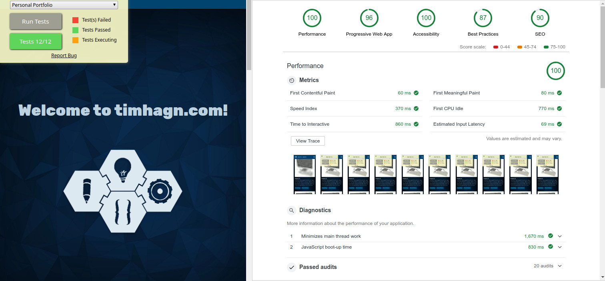

# #100DaysOfCode Log - Round 1 - Tim Hagn

The log of my #100DaysOfCode challenge. Started on [June 14, Thursday, 2018].

## Log

### R1D1-6
* all of @freeCodeCamp Javascript Algorithms And Data Structures Certification
* Khan Academy's "Computer science - Algorithms" Challenge
* got #uWSGI over #NGINX running for #Python with #Flask
* still learning reading bout Python

### R1D7
* first two lessons of @freeCodeCamp Front End Libraries Certification (Bootstrap & jQuery),  
  starting with Sass lesson  
* @khanacademy Advanced JS: Games & Visualizations to lesson 24  
* and still reading bout #Python, etc. etc. ^^
* at night: Sass lesson of @freeCodeCamp Front End Libraries Certification

### R1D8
* @khanacademy Advanced JS: Games & Visualizations last two lessons,
  not including projects  
* wrote #Python script to solve Clue #3 in @khanacademy Cryptography challenge 101
* completed React lesson of @freeCodeCamp Front End Libraries Certification
* cloned and began to write in this log
* prepared and played around with a #Python script to automate writing in this log(s) ^^

### R1D9
* completed Redux & Redux and React lessons of @freeCodeCamp
  Front End Libraries Certification.
* initialized local razzle + Redux playground for the Projects to follow
* played a little more with the #Python script to automate writing in the logs

### R1D10
* tried doing first Project of @freeCodeCamp Front End Libraries Certification,
  Random Quotes, with React + Redux, but SSR in local Playground needed some
  tinkering.
* much reading on SSR, Python, Twitter API, etc.

### R1D11
* after wrecking my head I got the Project running in #CodePen,
  but #Redux still makes Problems
* read more about #Python and a little bout Natural Distributions

### R1D12
* didn't get to do much today, as I had to save a client's hacked Website
* read again about #Python and more bout Natural Distributions and did some
  Challenges on @KhanAcademy

### R1D13
* didn't get to much today, again - Hacking aftermath bug-fixing % )
* did some Challenges on @KhanAcademy

### R1D14
* still a little groggy, but tinkered with @babel 7
  & #freeCodeCamp Projects
* did some Challenges on @KhanAcademy again,
  but their streak counter is buggy -.-

### R1D15
* had a meeting with a client, so only
  some Challenges on @KhanAcademy again
* read more #Python and bout #React Context API

### R1D16
* prepared for a Drupal 8 project with
  legacy base % )
* started Memory Game Project on @KhanAcademy

### R1D17
* finally finished #freeCodeCamp Project
  "Random Quotes Machine" with #React Context API
* more reading and challenges : )

### R1D18
* cleaned up "Random Quotes Machine"
  #freeCodeCamp Project
* dived into Context API + Redux
* nearly finished @KhanAcademy 's
  Advanced JS: Games & Visualizations

### R1D19
* got further with @KhanAcademy 's
  Journey into cryptography
* used and digged deeper into #Redux
* looked where I might contribute
  to #OSS repos : )

### R1D20
* reprog "Random Quotes Machine"
  #freeCodeCamp Project
  to #reactjs & #Redux
* digged into Middleware
  & Currying with #ES6
* did some @KhanAcademy challenges

### R1D21
Not much for today, had to work
on a client's mobile-menu.
But:
* did some @KhanAcademy challenges
* prepared second @freeCodeCamp
  Frontend Library Cert Project
* some more reading for #Python
* some reading on #GDPR % )

### R1D22
Although I'm still working on the
client's site, I did:
* finish the second @freeCodeCamp
  Frontend Library Cert Project
  "Build a Markdown Previewer"
* more reading on #GDPR & #Python
* some @KhanAcademy challenges

### R1D23
Oh, I jumped a day (21th) here % )
So, fitting, on a prime day I did
* nearly finish @KhanAcademy's
  "Journey into Cryptography"
* more reading on #GDPR & #Python

### R1D24 + 25
Was relaxing a little yesterday
and only wrote part of a #Python
script for the challenge
and today I:
* finished @KhanAcademy's
  "Journey into Cryptography" : )
* read more about #Python

### R1D26
Didn't get to tweet yesterday,
so here are my proceedings
* started @KhanAcademy's
  "Journey into
  information theory"
* finished a coding challenge
  by @dan_abramov but it
  seems like his mailbox ran
  amok with DMs ^^

### R1D27
* finished third @freeCodeCamp
  Frontend Library Cert Project
  "Build a Drum Machine", but
  still have TODO:
  Styling, Bank switch, etc. ; )
* more reading and playing
  around with #React & #Redux
  and packaging

### R1D28
Not much done, had to implement
GDPR compliant Privacy- &
Cookie-policies and such for
a client. But still I worked on:
* @KhanAcademy's "Journey into
  information theory"
* some tinkering with the
  @freeCodeCamp Project
  Drum Machine

### R1D29 + 30
* continued @KhanAcademy's
  "Journey into
  information theory"
* "conquered" #GoogleAnalytics
  #GDPR Privacy- & Cookie
  compliant implementation.
  Only read and talked about next
  steps of my freelance-journey
  and new Website. (Last one I
  did in 3-4 days for my
  Media-Design Exam 2015 % ).
* Prepared (physically and mentally
  ; ) for my the next "prime" of my
  life with my wife
  > It rhymes, and what rhymes,
    is good.
  (Pumuckl ; )  

### R1D31 - 33
Although I took it slowly on my
B-Day and the "aftermath" the
following days, I still managed
to finish @KhanAcademy's "Journey
into information theory" as well
as "How Computers Work" and
"How the internet works" (why did
they put the basics at the end oO?).
▓▓▓▓░░░░░░░ 33% (1/3 : )

### R1D34
Not much, just
* started @freeCodeCamp Project
  "Build a JavaScript Calculator"

### R1D35
Just a few hours I
* worked on and nearly finished
  @freeCodeCamp Project
  "Build a JavaScript Calculator"

### R1D36
* went on in @KhanAcademy's
  "Advanced JS:
   Natural Simulations"
* finished @freeCodeCamp Project
  "Build a JavaScript Calculator"

### R1D37
* back in @KhanAcademy's
  "Advanced JS: Natural
  Simulations" the Force(s)
  was(were) with me ; )

### R1D38 - 40
Didn't come to much, these last
days, encountering my old fiend,
the Blues. But still got to do
some of @KhanAcademy's
"Advanced JS: Natural Simulations"
and reading more on #Python and
=> #Entrepreneurship

### R1D41
Not much, just
* started @freeCodeCamp Project
  "Build a Pomodoro Clock"

### R1D42
* still in @KhanAcademy's
  "Advanced JS: Natural
  Simulations" I tried to
  improve my Mountain Range
  Project

### R1D43
* starting short before midnight
  (so to say still on D42 % )
  I got back into @freeCodeCamp
  by doing some Challenges from
  their "Coding Interview Prep"
* finished my @KhanAcademy's
  Mountain Range Project

### R1D44
* still in @KhanAcademy's
  "Advanced JS:
  Natural Simulations"
  (Angular Movement)
* back into the @freeCodeCamp's
  "Build a Pomodoro Clock", all
  Buttons working in Theory,
  next up is Styling & Timer ^^

### R1D45
* @freeCodeCamp's "Build a
  Pomodoro Clock" still is
  with me, didn't have much
  time today, as after the
  #BloodMoon, the sun was
  calling me to the park ; )
* there the first chapters of
  @AustinKleon's "Show Your
  Work!" bedazzled me ^^  

### R1D46
After skipping a day on Sunday,
Monday was D46 instead of D47:
* nearly finished @freeCodeCamp's
  "Build a Pomodoro Clock", but
  some tests were failing -.-
  (now running on D47 ; )

### R1D47
Finally - and still in July % )
* Finished @freeCodeCamp's
  "Build a Pomodoro Clock" with
  all tests passing, such being
  able to claim my
  Front End Libraries
  Certification : )

### R1D48
* sped through @freeCodeCamp's
  first three chapters of
  "Responsive Web Design
  Certification", Basic HTML(5),
  Basic CSS and Applied Visual
  Design in 74 min., as I'm
  already working on my new
  portfolio (home)page and
  am interested in CSS-Grid ; )

### R1D49
* today me took "slower" steps
  and went through the next
  three of @freeCodeCamp's
  "Responsive Web Design
  Certification" chapters.
  Next: On to CSS-Grid!
After all today is our 10th
wedding anniversary, which
of course computes first : )!

### R1D50
Today @freeCodeCamp's
CSS-Grid section & project
"Build a Tribute Page"
- sad theme #TerryPratchett,
but #makefrontendshitagain ; )
I'll mostly read this weekend,
traveling with "Connie",
my T-101MT ^^.
▓▓▓▓▓░░░░░ 50%

### R1D51 & R1D52
As nearly foreseen, I only
got to reading about different
topics like Docker, redux-saga,
Observables in JS and such % ).
Back in the Game and on the
Keyboard again today : ).

### R1D53
Yip, back in the game : )!
* finished @freeCodeCamp's
  Responsive Web Design
  Project "Build a Survey Form"

### R1D54 - R1D56
Felt a little under the weather
(and wished it would rain % )
the last days so didn't tweet,
but still read more about #Python,
ML & chatbots.
Finished the first part "Data
Visualization with D3"of
@freeCodeCamp's "Data
Visualization Certification".

### R1D57
* finished the second part
  "JSON APIs and Ajax"
  of @freeCodeCamp's "Data
  Visualization Certification"
* started @freeCodeCamp Project
  "Build a Product Landing Page"

### R1D58
* pushed my @freeCodeCamp "Front End
  Libraries Certification" Projects
  to @GitHub and mirrored them on
  @Bitbucket, suit yourself ; ).
* finished @freeCodeCamp
  "Product Landing Page" Project

### R1D59
* added watch script to repos
* started @freeCodeCamp Project
  "D3 Bar Chart" from "Data
  Visualization with D3"

### R1D60
Yesterday I needed a break,
but still read about #Python,
which seems to be my fallback
"solution" when I have no energy % ).

### R1D61
* finished @freeCodeCamp Project
  "D3 Bar Chart" from "Data
  Visualization with D3"

### R1D62 & R1D63
On Wednesday I only came to reading
bout #Python again (after all it was
a bank holiday here ; ).
Yesterday I started the @freeCodeCamp
Project "D3 Scatterplot Graph" from
"Data Visualization with D3".

### R1D64
* continued working on the
  @freeCodeCamp Project
  "D3 Scatterplot Graph" from
  "Data Visualization with D3".

### R1D65 & D66
After being under the weather,
I only came to some reading
about #Python and #reactjs on
Saturday and took the day off
on Sunday. Today I at least
continued working on the
@freeCodeCamp Project
"D3 Scatterplot Graph" from
"Data Visualization with D3".

### R1D67
Feeling slightly better, so
* finally finished @freeCodeCamp
  Project "D3 Scatterplot Graph"
  from "Data Visualization with D3"
  and so solved their
  #ProjectOfTheDay : )

### R1D68
* created repos for the Project of
  @freeCodeCamp's Certifications
  "Responsive Web Design" &
  "Data Visualization with D3"
  and mirrored them on BitBucket
* started @freeCodeCamp "Front End
  Libraries Certification" Project
  "Technical Documentation Page"

### R1D69
* did a lot of reading, but not
  as fallback, but by intention ^^.
  Doing #JS vs. #PHP vs. #Python
  for my @freeCodeCamp "Front End
  Libraries Certification" Project
  "Technical Documentation Page"
  Do you know, what ?...$val means
  in #PHP? Read about it in my
  Project (to become Blog-Post ; ).

### R1D70
After @ka11ways talk at #byteconf,
I'm gonna heed his words and
won't reset the challenge,
but try to get back on track
on Monday (at the latest ; ).
Today I only stayed tuned in
on @byteconf and definitely
catch up their other talks
on YouTube!

### R1D71
As promised I returned to the
challenge and continued working
on my @freeCodeCamp
"Responsive Web Design
Certification" Project
"Technical Documentation Page"
but it's rather turning into a
full scale blog post ^^. 1/2

2/2 All while trying an
update to Mint 19 on my
Dev-@TUXEDOComputers
Laptop, with a first for me:
the Ethernet Card won't work,
while WiFi worked out
of the box % ).
(Probs with an RT8111/8168,
but I'm gonna get it running! ; )

### R1D72P1
After fixing the Problems
with the RT8111/8168 (see
R1/D71) in Mint 19, I dived
into the intestines of
systemd-resolved.
Hoped to get it running
with my old local .test
confs for nginx and
uWSGI #Python, but had to
disable it % |.
Now some coding ^^.

### R1D72P2
Finally coding, I continued
working on my @freeCodeCamp
"Responsive Web Design
Certification" Project
"Technical Documentation Page".
Implemented the start of
a Pure-CSS Burger-Menu,
using :target Pseudo-Element
and added line numbering to
code elements.

### R1D73
* "Finished" the Pure-CSS
  Burger-Menu via :target
  (have to tweak anims ; )
  Added PHP variables and
  tests are now all passing
  for the @freeCodeCamp
  Project "Technical
  Documentation Page".
* Finally came to watching
  more of @byteconf on YT.
// Left Testing Big with BigTest in React 11:49

### R1D74
Been a while for me
writing bash scripts,
so wrote one to ease
backing up client's server
and local Dev instances.
Continued @freeCodeCamp
Project "Technical
Documentation Page"
It's now nearly as long
as their example, and
now just covers vars
and types...

### R1D75
Still continuing with my
@freeCodeCamp Project
"Technical Documentation Page"
and now threw #Python in
the variable comparison part
and enhanced some examples.
But take a sneak peek below : ).
25 days left to go!
▓▓▓▓▓▓▓▓░░░ 75%

### R1D76
Speaking with @MBrazeilles
from @mjmlio (kudos again ; )
spurred my ambition and
I looked into their App and
MJML 4.
Found a quirk with Migrating
my signature from V3 but will
try to solve it myself
before opening an issue
(might be my machine : ).

### R1D77 + R1D78
Took a day off on Sunday, as
we were at @BuskersWien
Street Art Festival and got
into the After Party % ).
So yesterday dived into
mjmlio-app's migrate code and
read some info about finite
state machines in #reactjs.

### R1D79
Looked further into the code
of mjml and IntelliJ Idea
nearly crashed while indexing,
after installation of that many
(recursive) node_modules with
"yarn" within the packages folder ^^.
Problem solved, no worries...

### R1D80
After getting NodeJS debugging
running in Idea, I looked into
my mjml problem.
Switched to and fro
my @freeCodeCamp
"Tech Doc Page".
▓▓▓▓▓▓▓▓░░ 80%
Oh, and:
Happy #InternationalProgrammersDay!
But my wife put it way better:
https://twitter.com/ninahagn/status/1040272691444547584

### R1D81
My MJML-debugging was "useless",
migrate-probs arose through
html-comments...
More of @freeCodeCamp
"Tech Doc Page", feels
like I'm writing a book ; ).
And I found a "gem" of my
#Pascal days from the 90's,
will try pushing it to a repo
on the weekend % ).
Oh, and I watched more of @byteconf,
only one vid left to go...
And of course @NikkitaFTW's vid : ).

### R1D82
Went down memory lane today,
found my old Turbo Pascal 6.0
and installed it in DosBox
- only to sadly realize,
some TPUs (precompiled TP
Units, today might be
classes ; ) for the game
I wrote are missing : (.
Trying to find them online,
but to no avail...

Oh, maybe they are missing because
I now have 404 followers *lol*?
Thnx to all of you anyways : )!

### R1D83
Still recuperating from landing
at a Party in a squatted house
nearby together and returning
home Sunday after sunrise.
Only managed research for
the Book I got the TPUs from
and finally found it:
PC Underground of Publisher
Data Becker (R.I.P ; )

### R1D84
Found attached English
CD-ROM to the #Pascal & #TASM
book online & started tinkering
to get it to compile in TP6...
But read for yourself in the repos
to the game with a little history
sprinkled on top : ).

### R1D84 (addendum)
Started @freeCodeCamp's "Apis And
Microservices Certification",
finished "Managing Packages with
npm Challenges".

### R1D85
Continued my @freeCodeCamp
"Tech Doc Page", started their
"Apis And Microservices
Certification" finishing
"Managing Packages with
npm Challenges" and starting
"Basic Node and Express
Challenges"- to clear my
head of #Pascal ; ).
▓▓▓▓▓▓▓▓▓░░ 85%

### R1D86
Started'n'finished "Node and
Express" of "Apis And
Microservices" Cert.
But @glitch just doesn't fit
my usual @nodejs workflow...
Afterwards productive meeting
with my designer-wife @ninahagn;
talked and decided about my new
Profile-/Homepage design.

### R1/D--
Didn't code today, was out last night till 4am % ).  
But I've an important question for you,  
please vote & RT  
(Leave a comment for other ideas.  
Frontend will be #reactjs : )!

Which Backend should I use  
for my new Profile / Homepage?   
(\* is new for me)   

10 Votes:  
00% Stick with Drupal  
10% WordPress (don't like ; )  
20% Try Flask / Django \*  
70% node.js (GatsbyJS? \*)

### R1D87 (split)
As on the weekend I only
researched bout @gatsbyjs
& #VPS vs. #PaaS for #NodeJS
hosting, I'm only gonna
count it as one day.
But we bought & solved two
puzzle-cubes from the
"Museum of Illusions" - does
that count as "hardcoding" ; )?

### R1D88
Tinkered with @gatsbyjs  
& played around with
styled-components and such.
Got a little bugged by
my current hosting
not providing #NodeJS...

Finished @freeCodeCamp's
Timestamp Microservice Project
as a cooldown... % )

Why do you want both a #github
repo and #glitch link _both_ to be
able to complete the Project oO?

### R1D89
Couldn't code much today,
as a fruitful meeting with
my Designer-Wife @ninahagn
took place : ).
Then we resealed our windows,
temps are dropping -.-
But I at least finished
@freeCodeCamp's Header Parser
Microservice Project ; ).

### R1D90
Went through the @freeCodeCamp
MongoDB and Mongoose Challenges,
but if I hadn't known #MongoDB
before, I might have been stumped.
Maybe should finally contribute % ).
Finished the URL Shortener
Microservice Project afterwards : ).

I used my URL shortener for the above link, but twitter linked through % ). Link on Glitch: https://th-fcc-su.glitch.me/  And I forgot to add: ▓▓▓▓▓▓▓▓▓░ 90%

### R1D91
Finished @freeCodeCamp's
Exercise Tracker Microservice
Project after failing to get
razzle running on @glitch,
then stumbling over CRA
on it (kudos!) and playing
around with GatsbyJS on
@codesandboxapp : ).

And here it is on glitch: https://th-fcc-exercise.glitch.me/
Did I say, that I like async ... await functions?
I like async ... await functions ^^.

### R1D92 (part 1)
Finished @freeCodeCamp's
"File Metadata Microservice"
Project and got me my
"APIs and Microservices Certificate",
that's makes it a triple : ).
As I needed less than half
an hour for it, that won't
be all for today, so stay tuned!

### R1D92 (part 2)
As said before, while I did
@freeCodeCamp's MongoDB
challenges and projects,
I was a little annoyed at times
by warnings and errors with
outdated packages.
So I just opened my first PR to the Repo.
Wish me luck : ).
https://tinyurl.com/th-fcc-pr

### R1D93
Having coded nothing on the
weekend (needed a break after
last week % ), I jumped straight
back in and finally finished
@freeCodeCamp's "Heat Map" Project.
Afterwards finished the
"Choropleth Map", which seemed
easier than the first (except
D3.js v5 % ).

### R1D94
The last Project of @freeCodeCamp's
"Data Visualization Certification"
was harder than the one before
(too many examples still use D3.js v4
or even v3 - but I went with v5 % ).
But got me my certificate, that's
a quadruple now : ).

### R1D94 (part 2)
Started and finished "Introduction
to Information Security with
HelmetJS Challenges".

### R1D95 (part 1)
Started #hacktoberfest with two PRs
to @freeCodeCamp's InfoSec Course's
"HelmetJS" & "bcrypt" challenges.

### R1D95 (part 2)
Was getting eager for #hacktoberfest,
so on to the hunt for a few candidates.
Afterwards, I managed to squeeze a
few commits to my @freeCodeCamp's
"TecDoc Page" in.
▓▓▓▓▓▓▓▓▓▓░ 95%

### R1D96 (part 1?)
Finished @freeCodeCamp's
"QA with Chai Challenges".
Afterwards I adapted the
functional tests in it's  
boilerplate Repo to newer
zombie behavior and
created (another %) PR...

### R1D97
After taking another break
over the weekend and doing
client-work yesterday,
I jumped back into @freeCodeCamp
and finished 13 of the 22
"Advances Node and Express
Challenges" with authentication.

### R1D98
Finished the rest of @freeCodeCamp's
"Advances Node and Express
Challenges" (and definitely will
have to do a PR, they are buggy ; ).
Afterwards did the Project
"Metric-Imperial Converter"
and "relaxed" with 2 of
Project Euler algos.

### R1D99
1/3
Of course it was a bad idea
to get back into the challenge
after more than a 24h of
sleeplessness, but still managed
to finish @freeCodeCamp's
"Issue Tracker Project" in way
too much time: ~2h til the tests
were all showing green - but
wait for it:

2/3
Later over 4 more hours of
debugging caused by a switched
key / value pair -.-

And I didn't post any updates,
cause I was feeling under the
weather with partially self-imposed
ailment for the last week where
I just got to some reading and
too many thoughts and ideas...

3/3
...bad ones of both kind, I just
can't count for the challenge % |.

But on to a final sprint ^^!

Here's the Issue Tracker:
GitHub: https://github.com/timhagn/th-fcc-issue
Glitch: https://th-fcc-issue.glitch.me/

### R1D100
▓▓▓▓▓▓▓▓▓▓ 100%
On my last day of the Challenge
I binge-programmed through the
last three @freeCodeCamp ISC-Projects
and got my fifth Certificate : ).
P.S.: I'm thinking bout giving
me a penalty, but more on it
tomorrow, am completely burnt % ).

### R1D100 + P1+2
Thnx for your kindness!
I completely forgot to tell you,
that I'm already in my penalty ^^.
Yesterday I did a PR to
"styled-media-queries", bumping
it to styled-components 4
and Babel 7. Today I wrote
the first tests in jest for it : ).
#Hacktoberfest

### R1D100 + P3
As I had to go to the German consulate
today to get my ID renewed and apply
for a passport, I just managed to give
me a quick intro to react-test-renderer &
jest-styled-components, try to write
some tests with them and... fail % ).
#Hacktoberfest2018

### R1D100 + P4
Today I finished writing the tests
while getting myself an intro to
jest-styled-components.
With finishing this PR, I reached
my goal for #Hacktoberfest : ).
https://hacktoberfest.digitalocean.com/stats/timhagn

### R1D100 + P5
Started @freeCodeCamp's "Personal
Portfolio Webpage" Project. Trying
it with Drupal as Backend and
Gatsby as Frontend, but ran into
Permission problems on my hosting -.-

### R1D100 + P6 (part 1)
Yesterday's Problem didn't arise
through Drupal permissions, but
rather through DDOS prevention
on my hosting. I therefore created
a PR with a rateLimit for
gatsby-source-drupal : ).
#Hacktoberfest
Am coding on ^^.

### R1D100 + P6 (part 2)
After the PR was done and Gatsby
working with Drupal, I continued
working on @freeCodeCamp's
"Personal Portfolio Webpage" Project.
8 of 12 tests are passing and I'm  
getting comfy with GraphQL : ).

### R1D100 + P7
Happy ol' hallow's eve, everyone ^^!
#HappyHalloween
I continued working on @freeCodeCamp's
"Personal Portfolio Webpage" Project.
Now all tests are passing, but still
got much to do (especially getting
the Projects from Drupal).

### R1D100 + P8
In the aftermath (I like this word ; )
of Hallow's eve, I only managed to
fix some styles and finish my NavBar.
More in the morrow ^^.

### R1D100 + P9
Felt under the weather this week
and down with some sickness.
Only managed to help a few newbies,
(I hope so ; ).
Today I struggled for ~10h with
Gatsby and dependency hell cause
of a well meant change to my PR
to it - but up and running, again : ).

Yeah, maybe I should restart my
penalty, but feeling penalized enough
as it is % )...
What do you think?

### R1D100 + P10
Continued working on my Portfolio
Page (yup, still @freeCodeCamp ; ),
sitting at the Projects Part (last
one) and getting the hang about
mixing #Drupal & #Gatsby : ).

### R1D100 + P11
As I was annoyed with existing
workarounds to use the amazing
"gatsby-image" as a background
image, I salvaged it to start a
"gatsby-background-image"
component using CSS ^^.
Hope to be able to release to the
wild next week, stay tuned : ).

### R1D100 + P12 & 13
Completely forgot to post yesterday,
cause after proggin, there was
(kitchen deep) cleaning.
Finally finished my Portfolio Page,
added a 404 today and "only" have
to replace the dummy content with
the real thing tomorrow : ).

### R1D100 + P14 & 15
Didn't forget to tweet, just couldn't
account for "real coding".
Wrote text for the site, looked
into an Android App for an aquaintance
and refactored a little...
Can anyone explain to me, why the
backgroundStyles won't be set?

### R1D100 + P--
On Saturday I thought I failed a quite long
assessment test - but seems I didn't % ).
But, alas, my main workstation's Motherboard
suddenly stopped working yesterday,
that's why I didn't post -.-
Hope to get back up and running this week...

### R1D100 + P16
Replaced my main workstation with
my Dev-Laptop for the moment.
Had to attend a "coding interview"
in the afternoon for ~2h, and
I don't know if I nailed or failed,
feeling like the latter -.-
But we gotta see, what we gotta see...
#braindead now...

### R1D100 + P17
Can't believe the interview did
in fact go well, after all % ).
Got up and... uhm... limping again
and at least managed to continue
with my Portfolio Page (some errors
like 404 & favicons still remaining... ; ).
First audit (on server):

### R1D100 + P18
Got stuck with HTML normalization
today while writing and receiving
texts from the #Drupal backend.
And yup (don't hit me) I even tried
RegEx % ). Why isn't there a _simple_
alternative for DOMParser in @nodejs?
Or did I miss something in @Gatsby?

### R1D100 + P19
Sidetracked myself from the portfolio
with creating a React Component for
automated mocking up of Screenshots
to be realized as a @npmjs & #Drupal
module later on (was dissatisfied
with my project images ; ).
Only fixed some grid CSS on the site...

### R1D100 + P20
Took today "slowly" and "only" worked
on updating my PRs to "styled-media-query",
two @freeCodeCamp boilerplates
(@ossia will they ever get merged? ; )
and updated "MockMe" with choose-able
mock images. Also started preparing
it for usage as a #Drupal Module : ).

### R1D100 + P21
Worked for only 3h33m till now,
but hey, it's Sunday ; ).
Now you can grab external Screenshots
with MockMe, a.t.m. through the sadly
discontinued PhantomJS. Integrated
back end with composer and wrote
first steps of a #Drupal integration : ).

### R1D100 + P22,23,24,25
Didn't stop working the last
four Days, just was to groggy
after it to post ^^.
Still on my "MockMe" Sidetrack,
meanwhile it's integrated in
Drupal, I just have to switch
the Widget for a Preview...
Is this procrastination % )?
